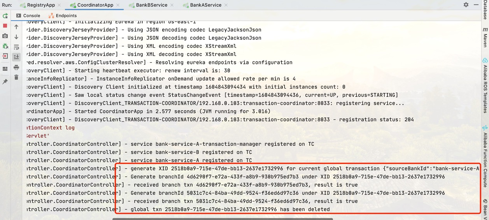

### Requirements
* 最基础的本地数据库实现A B同库转账，
* 再到跨库转账(分布式事务)，
* 再到热点账户转账(单账户1W TPS) 消息队列 + 分布式事务

### Basic Idea
* 为了模拟分布式，项目可以简单分成两个module，一个为转账发起方，一个为转账接收方
    * 对于本地数据库转账，发起方和接收方可以不做区别，直接利用数据库事务完成转账。
    * 对于跨库转账：
        * 发起和接收方以及TC注册eureka并利用feign通信
        * transaction manager开启全局事务，并获得全局事务id （XID）
        * 各个银行服务向TC注册分支事务，获得branch_id，本地写数据库，写undo_log用于事务回滚
            * 所有分支都成功后向TC发送消息，TC删除对应的全局事务meta，每个服务删除相应的undo_log
            * 如果有任一分支失败，则向TC发送事务失败消息，TC删除此事务相关meta，每个服务重放undo_log中相反的操作以还原账户
              信息，如果undo_log不存在，则可以认为错误发生时undo_log未写入，则不做其他处理。
        * 无论成功或者失败，本次事务结束。
    * TODO：对于热点账户：事务管理与普通跨库转账一致
        * 发起方本地修改db账户余额，发送转账成功消息至消息队列，返回受理结果
        * 接收方拉取消息队列消息，修改接收方账户余额，（删除队列中已消费的消息）
        * 利用**分布式事务协议**完成两个服务各自的事务，需要考虑**幂等性**与消息列队传输的**可靠性**
        
#### 跨库转账
* 拟采用类似seata的2pc协议实现来保证分布式事务性
    * service-registry-server为eureka注册服务进程
    * 两个bank service进程，连接不同的数据库，其中一个作为消费者调用另一个service，通过feign实现远程调用。
    * Transaction Coordinator为独立进程，处理两个银行进程的事务相关请求，并维护全局和分支事务metadata
    * 具体的协议实现
    * what's next: 
        * mybatis可以采用spring-boot官方的template，当前实现对于多线程的支持不好
    * 实验截图：
        * 事务成功：
        
        
        
        
        * 事务失败：(任一服务失败或都失败皆不会导致账户余额错误)
        
        